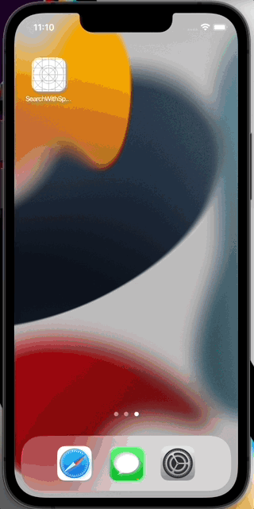

# react-native-search-with-spotlight

A React Native module to search with Spotlight for iOS.

 

## Futures

- It supports new architecture with React Native 0.68+.


## Installation

<!--
```sh
yarn add https://github.com/mitsuharu/react-native-search-with-spotlight.git
```
-->

```sh
yarn add react-native-search-with-spotlight
```

## Usage

You see `example` directory for details.

### React Native


```typescript
import * as SearchWithSpotlight from 'react-native-search-with-spotlight'

const isSupported = await SearchWithSpotlight.isSupported()
```

### iOS

(OPTIONAL) When use iOS 10+, you can obtain a search query. It adds `CoreSpotlightContinuation` key to `Info.plist` file with a Boolean value of `YES`.

```
<key>CoreSpotlightContinuation</key>
<true/>
```


It adds some codes to `AppDelegate.m` file.

```Objective-C
#import <react-native-search-with-spotlight/SearchWithSpotlight.h>

- (BOOL)application:(UIApplication *)application didFinishLaunchingWithOptions:(NSDictionary *)launchOptions
{
  // initilize app

  // If SearchWithSpotlight is not set bridge, you should set bridge manually
  // [SearchWithSpotlight setup:bridge];
  
  return YES;
}

- (BOOL)application:(UIApplication *)application continueUserActivity:(NSUserActivity *)userActivity restorationHandler:(void (^)(NSArray<id<UIUserActivityRestoring>> * _Nullable))restorationHandler
{
  return [SearchWithSpotlight handle:userActivity];
}
```


## Contributing

See the [contributing guide](CONTRIBUTING.md) to learn how to contribute to the repository and the development workflow.

## License

MIT
